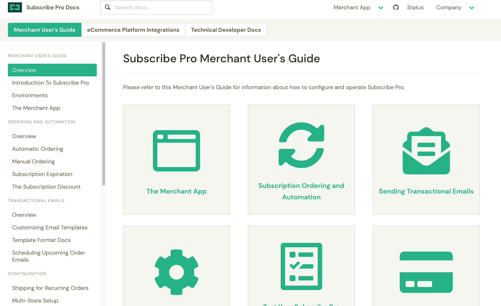

# Documentation Writing Sample
Developer docs written for SubscribePro's Merchant App UDFs Feature.

</img>

[Soon to be published here](https://docs.subscribepro.com/users/merchant-app/)

## User Defined Fields

User Defined Fields (or "UDFs") allow you to add highly customizable data to individual entities throughout the Merchant App.

### [User Defined Fields in the UI](/user-defined-fields-ui.md)

### [User Defined Fields with the API](/user-defined-fields-api-endpoints.md)

### [User Defined Field Definitions](/user-defined-field-definitions.md)

### [User Defined Field Mapping Rules](/user-defined-field-mapping-rules.md)

### [User Defined Field Example Scenario](/user-defined-field-example-scenario.md)
